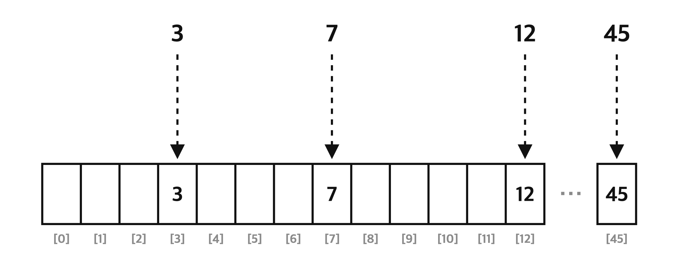
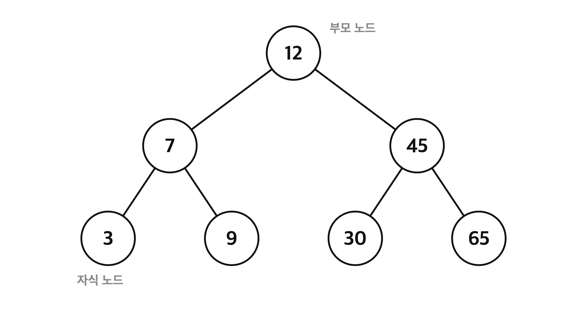
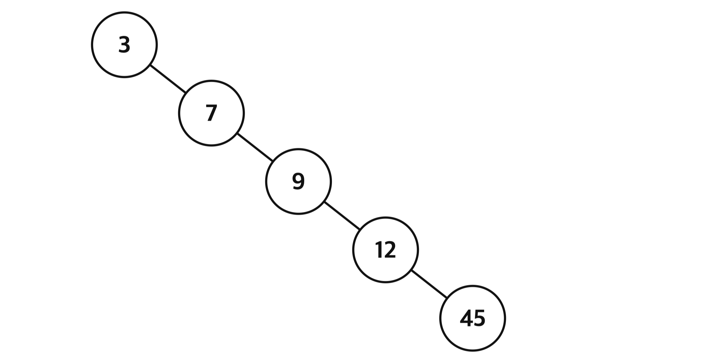
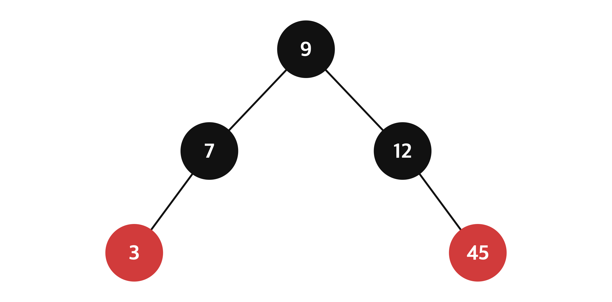
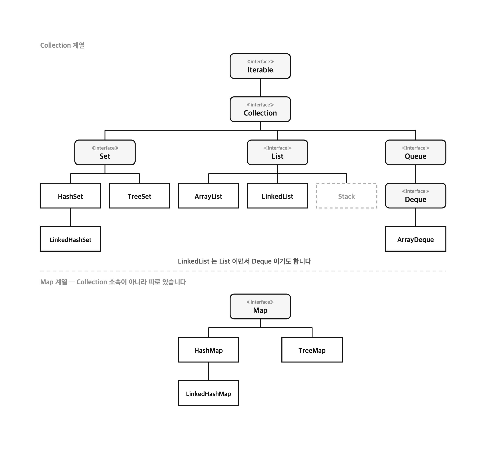

# ☘️ 고급 Java [1] - 제네릭 (Generic) & 자료구조

## 목차

- [[1] 제네릭이 필요한 이유](#1-제네릭이-필요한-이유)
  - [타입마다 클래스를 만드는 경우](#타입마다-클래스를-만드는-경우)
  - `Object` [클래스의 한계](#object-클래스의-한계)
  - [다운캐스팅과](#다운캐스팅과-classcastexception) `ClassCastException`
- [[2] 제네릭의 구조](#2-제네릭의-구조)
  - [제네릭의 형태](#제네릭의-형태-t) `<T>`
  - [타입 매개변수 관례 (T, E, K, V, N)](#타입-매개변수-관례-t-e-k-v-n)
  - [명칭 정리](#명칭-정리)
- [[3] 제네릭 적용하기](#3-제네릭-적용하기)
  - `GenericBox<T>` [와](#genericboxt-와-boxmain3) `BoxMain3`
  - [재사용성과 타입안정성](#재사용성과-타입안정성)
- [[4] 제네릭을 사용하면 좋은점](#4-제네릭을-사용하면-좋은점)
- [[5] 자료구조란](#5-자료구조란)
  - [자료구조와 컬렉션 프레임워크](#자료구조와-컬렉션-프레임워크)
  - [가장 기초가 되는 배열](#가장-기초가-되는-배열)
- [[6] 빅오 표기법](#6-빅오-표기법)
  - [O 안에 들어가는 것](#o-안에-들어가는-것)
  - [공간복잡도](#공간복잡도)
- [[7] 배열의 시간복잡도](#7-배열의-시간복잡도)
  - [인덱스 검색과 순차검색](#인덱스-검색과-순차검색)
  - [추가와 삭제](#추가와-삭제)
- [[8] 배열의 한계와 리스트](#8-배열의-한계와-리스트)
  - [배열의 장점과 단점](#배열의-장점과-단점)
  - [해결책은 리스트](#해결책은-리스트)
- [[9] ArrayList의 단점](#9-arraylist의-단점)
  - `size` [와](#size-와-capacity) `capacity`
  - [어디에 추가하느냐가 중요합니다](#어디에-추가하느냐가-중요합니다)
- [[10] 연결리스트 (LinkedList)](#10-연결리스트-linkedlist)
  - [노드를 이어붙이는 방식](#노드를-이어붙이는-방식)
  - [그림으로 보는 연결리스트](#그림으로-보는-연결리스트)
  - [조회가 느린 이유](#조회가-느린-이유)
  - [추가와 삭제가 빠른 이유](#추가와-삭제가-빠른-이유)
  - [정리](#정리)
- [[11] Set](#11-set)
  - [리스트의 한계](#리스트의-한계)
  - [Set의 특징](#set의-특징)
- [[12] Set을 직접 만들어본다면](#12-set을-직접-만들어본다면)
  - [배열에 그냥 담는 경우](#배열에-그냥-담는-경우)
  - [값을 그대로 인덱스로 쓴다면](#값을-그대로-인덱스로-쓴다면)
  - [나머지 연산으로 크기 고정하기](#나머지-연산으로-크기-고정하기)
- [[13] 해시 충돌](#13-해시-충돌)
  - [해결방법은 인정하는것](#해결방법은-인정하는것)
  - [그래서 평균 O(1)](#그래서-평균-o1)
- [[14] Set의 구현체](#14-set의-구현체)
  - [LinkedHashSet](#linkedhashset)
  - [TreeSet과 트리구조](#treeset과-트리구조)
  - [균형이 깨지는 경우](#균형이-깨지는-경우)
  - [레드 블랙 트리](#레드-블랙-트리)
- [[15] Set 주요 메서드](#15-set-주요-메서드)
- [[16] Map](#16-map)
  - [key와 value](#key와-value)
  - [HashMap](#hashmap)
  - [LinkedHashMap](#linkedhashmap)
  - [TreeMap](#treemap)
- [[17] Map 주요 메서드](#17-map-주요-메서드)
- [[18] 스택과 큐, 그리고 덱](#18-스택과-큐-그리고-덱)
  - [후입선출, 스택](#후입선출-스택)
  - [선입선출, 큐](#선입선출-큐)
  - [둘 다 되는 덱](#둘-다-되는-덱)
  - [덱의 주요 메서드](#덱의-주요-메서드)
- [[19] 전체 정리](#19-전체-정리)
  - [시간복잡도 한눈에 보기](#시간복잡도-한눈에-보기)
  - [컬렉션 프레임워크 전체 구조](#컬렉션-프레임워크-전체-구조)
- [[20] 조 편성](#20-조-편성)
  - [사다리 타기로 정합니다](#사다리-타기로-정합니다)
  - [조 편성 결과](#조-편성-결과)

---


# [1] 제네릭이 필요한 이유

제네릭에 대해 설명하기 위해 먼저 간단한 예시를 들어보겠습니다

## 타입마다 클래스를 만드는 경우

`IntegerBox`와 `StringBox`에는 값을 저장하고 (`set`), 꺼낼 수 있습니다(`get`)

보다시피 `String`,`Integer`로 먼저 타입을 지정한걸 알 수 있습니다


`BoxMain1`에선 `set`에 값을 넣을때, 올바른 타입으로 넣어줘서 오류가 나지 않은걸 확인할 수 있습니다


하지만 이렇게 코드를 짠다면 Box의 종류를 `StringBox`,`IntegerBox` 이렇게 두가지로 만들어야하는데 그렇다면 재사용성이 떨어지겠죠?

## `Object` 클래스의 한계

`ObjectBox`를 보면 모든 타입의 부모인 `Object`를 사용해서 만든걸 볼 수 있습니다


이 `ObjectBox`를 사용하는 `BoxMain2`에서는 `(Integer)`로 다운캐스팅을 한 모습을 볼 수 있습니다

따라서 `Integer`형은 사용가능하지만 아래에 있는 “숫자가 아니에요” 는 실행시 오류가 나게됩니다


## 다운캐스팅과 `ClassCastException`

아래 보시면 `get()`의 반환타입이 `Object`라서 다른 타입이 안에 있어도 컴파일 오류가 생기지 않아, 개발자입장에서는 코드를 직접 빌드하기 전까지는 오류를 알 수 없습니다.


여기서 알고가면 좋은건, 오류중에서는 컴파일오류가 제일 좋다 라는걸 알아주시면 좋습니다

즉, 이번에는 타입안정성에 문제가 생기고 있단걸 알 수 있습니다

**이러한 문제를 해결하기 위해 만들어진게 제네릭입니다**

---


# [2] 제네릭의 구조


## 제네릭의 형태 `<T>`

제네릭의 형태는 보통 `<T>` 이고 이 꺾쇠 안에 타입이 들어갈 자리를 만들어주게 됩니다

이 제네릭을 사용한다면 앞서 봤던 예제와 달리 타입을 미리 선언하지 않고, `T` 라는 타입매개변수를 넣어주게 됩니다

## 타입 매개변수 관례 (T, E, K, V, N)

`T`는 아래 보는것처럼 다양하게 바꿔쓸 수 있습니다


## 명칭 정리

여기서 한번 명칭을 정리해보고 가면 좋을것같아서 정리해보겠습니다

**타입매개변수(Type Parameter)**

`GenericBox<T>` 처럼 클래스나 메서드를 선언할때, 사용하는 T라고 보면 됩니다

**타입인자(Type Argument)**

`new GenericBox<Integer>()` 의 `Integer` 처럼 제네릭을실제로 사용할때 전달하는 구체적인 타입

**다이아몬드 연산자**

`new GenericBox<>()` 처럼 `new` 뒤에서 타입을 비워둔 `<>` 를 말합니다.

---


# [3] 제네릭 적용하기


## `GenericBox<T>` 와 `BoxMain3`

이어서 `GenericBox`를 보시면 제네릭 타입으로 메서드가 구성된걸 볼 수 있습니다


이 메서드를 사용한 `BoxMain3`에서는 이 제네릭을 통해서 원하는 타입으로 자유롭게 변경이 가능합니다


## 재사용성과 타입안정성

만약 예제의 `stringBox`에서 `set`에다가 `Integer`형을 넣게 된다면 컴파일 오류가나서 더 큰 오류가 생기기전에 방지할 수 있습니다

재사용성과 타입안정성도 얻을 수 있습니다

---


# [4] 제네릭을 사용하면 좋은점

**1. 타입안정성이 확보됩니다**

잘못된 타입이 들어오면 실행해보기 전에 컴파일 단계에서 바로 걸러집니다

**2. 재사용성이 올라갑니다**

`StringBox`, `IntegerBox` 처럼 타입마다 클래스를 만들 필요 없이 `GenericBox<T>` 하나로 끝납니다

---


# [5] 자료구조란

먼저 자료구조와 컬렉션 프레임워크가 뭐가 다른지 짚고가겠습니다

## 자료구조와 컬렉션 프레임워크

자료구조는 값을 어떻게 놓고 어떻게 꺼낼지에 대한 방법입니다

앞으로 볼 배열, 연결리스트, 트리 등등 전부 여기에 속합니다

**컬렉션 프레임워크는 자바가 그 자료구조들을 미리 구현해서 표준으로 묶어둔것입니다**

**그러면 왜 프레임워크라고 부를까요?**

규격을 인터페이스로 먼저 정해두고, 그 안에 구현체를 끼워넣는 구조이기 때문입니다

```java
List<Integer> list = new ArrayList<>();      // 조회가 많을때
// List<Integer> list = new LinkedList<>();  // 앞뒤로 넣고 뺄 일이 많을때

list.add(10);
list.get(0);
```

구현체만 갈아끼웠는데 `list.add()`, `list.get()` 을 쓰는 나머지 코드는 한 줄도 안 고쳐도 됩니다

**자바 컬렉션 프레임워크는 이런 인터페이스와 구현체를 제공하고 있습니다.** 

**(여기선 List가 인터페이스,ArrayList가 구현체입니다)**

## 가장 기초가 되는 배열

그중에서 가장 기초가 되는 배열부터 알아보겠습니다

배열은 같은 타입의 데이터를 정해진 크기만큼 순서대로 늘어놓은 자료구조입니다

```java
int[] arr = {10, 20, 30, 40, 50};

System.out.println(arr[2]);  // 30
```

보다시피 `arr[2]` 처럼 인덱스만 적어주면 원하는 값을 바로 꺼낼 수 있는걸 확인할 수 있습니다

배열의 특징은 이렇게 데이터를 찾을 때, 인덱스를 사용하면 `O(1)`의 시간복잡도로 자료를 찾을 수 있다는 점입니다

여기서 `O(1)`이 무슨 뜻인지 먼저 짚고가겠습니다

---


# [6] 빅오 표기법


## O 안에 들어가는 것


`O`는 빅오표기법이라고 하며, 괄호안에 있는 식이 바로 데이터가 늘어날때 걸리는 시간이 얼마나 늘어나는지를 의미합니다

이 표기법은 최악의 시나리오를 의미하기 때문에, `1`과 같은 상수가 안에 있으면 매우 빠른거고, `n`과 같은 변수가 안에 있으면 상수보다 오래 시간이 걸린다고 이해해주시면 됩니다

왜 변수가 더 오래걸리냐면 변수는 1,10,100 등등 수많은 수가 될 수 있기때문에 최악의 경우를 생각한다면 더 오래걸릴 수밖에 없습니다

참고로 상수끼리 더하는건 `O(1)`로 항상 치환됩니다

## 공간복잡도

이와 비슷한 표기법으로 공간복잡도라는 개념도 있습니다

다만 이 부분은 메모리와 관련된 부분이라 지금은 크게 신경안써도 되는 부분입니다

---


# [7] 배열의 시간복잡도


## 인덱스 검색과 순차검색

이제 아까 말했던 배열이 데이터를 찾을 때, 인덱스를 사용하면 해당 인덱스를 검색만 하면 되기때문에 `O(1)`의 시간복잡도가 걸립니다

하지만 인덱스를 모르고 값으로 찾아야 한다면 상당히 힘들어집니다...

```java
// 값 40이 몇 번 인덱스에 있는지 찾기
for (int i = 0; i < arr.length; i++) {
    if (arr[i] == 40) {
        System.out.println(i);
        break;
    }
}
```

배열의 크기가 `n`일때, 배열이 이렇게 순차검색을 하게 된다면 아까 빅오표기법에서 말했듯이 최악의 경우를 생각해야합니다

즉, 맨 뒤에 있는 값을 찾는 경우까지 생각해서 `O(n)`의 시간복잡도가 소요됩니다

## 추가와 삭제

이제 기존 데이터에다가 새로운 데이터를 추가 및 삭제한다고 가정하겠습니다

배열의 첫번째 위치에 데이터를 넣을시, 첫번째 위치를 찾는데 `O(1)`, 모든 데이터를 한칸 씩 뒤로 이동해야하므로 `O(n)`의 시간복잡도가 걸려서 총 `O(n)`의 시간복잡도가 걸립니다

```java
int[] newArr = new int[arr.length + 1];

for (int i = 0; i < arr.length; i++) {
    newArr[i + 1] = arr[i];  // 한칸 씩 뒤로 밀기
}

newArr[0] = 5;
```

배열의 중간 위치에 추가하는것도 평균적으로 절반을 밀어야해서 `O(n/2)`의 시간이 걸리므로 결국 `O(n)`이 걸리게 됩니다(같은 차수끼리는 같음)

이와 다르게 마지막 위치에 추가하게 된다면 인덱스를 통해 마지막 인덱스에 접근해서 데이터를 추가하면 끝이기 때문에 `O(1)`이 걸리게 됩니다

삭제도 이와 똑같습니다

앞이나 중간을 지우면 빈자리를 메우려고 뒤에 있는 데이터를 전부 앞으로 당겨와야해서 `O(n)`, 마지막을 지우면 `O(1)`이 걸립니다

---


# [8] 배열의 한계와 리스트


## 배열의 장점과 단점

정리하자면 인덱스를 사용해서 검색이 가능할때 위주로 배열을 사용하는것이 좋습니다 (마지막 자리에 값 넣기, 인덱스 검색)

배열은 순서가 있고, 중복을 허용하지만 크기를 동적으로 변경할 수 없어서 불편합니다

```java
int[] arr = new int[5];

arr[5] = 60;  // ArrayIndexOutOfBoundsException
```

보시면 크기를 5로 잡아둔 배열에 6번째 값을 넣으려고 하니까 오류가 나는걸 확인할 수 있습니다

아까 제네릭에서 오류중에서는 컴파일오류가 제일 좋다고 했었는데, 이건 실행시 오류라서 더 곤란한 경우겠죠?

## 해결책은 리스트

이러한 배열에 대한 해결책으로 리스트가 있습니다

리스트는 순서가 있고 중복을 허용한다는 배열의 성격은 그대로 가지면서, 크기를 동적으로 변경할 수 있습니다

여기서 리스트는 `List` 라는 인터페이스이고, 그중에 배열로 만든 구현체가 `ArrayList` 입니다

```java
List<Integer> list = new ArrayList<>();

list.add(10);
list.add(20);
list.add(0, 5);  // 원하는 위치에도 추가 가능

System.out.println(list);         // [5, 10, 20]
System.out.println(list.size());  // 3
```

여기서 `List<Integer>` 의 `<Integer>` 가 눈에 익으실텐데, 앞에서 봤던 타입인자입니다

**즉, 컬렉션 프레임워크는 제네릭을 사용해서 앞에서 배운 내용이 그대로 이어집니다**

---


# [9] ArrayList의 단점


## `size` 와 `capacity`

`ArrayList`가 크기를 바꿀 수 있다고 했지만, 사실 배열의 크기는 여전히 고정입니다

`ArrayList`는 안에 배열을 하나 들고 있다가, 그 배열이 꽉 차면 1.5배 짜리 새 배열을 만들어서 통째로 복사합니다

크기가 늘어나는게 아니라 더 큰 배열로 갈아끼우는거라고 보시면 됩니다

그래서 `ArrayList`는 실제 데이터 개수인 `size`와, 확보해둔 배열 크기인 `capacity`를 따로 관리합니다

```java
List<Integer> list = new ArrayList<>();
list.add(1);

// size     = 1
// capacity = 10
// 내부배열  = [1, null, null, null, null, null, null, null, null, null]
```

보시면 값은 하나인데 자리는 10개를 잡아둔걸 확인할 수 있습니다

즉, 데이터가 얼마나 추가될지 모르는 경우 나머지 공간은 사용되지 않고 낭비될 수 있습니다

## 어디에 추가하느냐가 중요합니다

그리고 `ArrayList`는 추가할때 어디에 추가하느냐에 따라 성능이 완전히 달라집니다

마지막에 추가하는건 밀어낼 데이터가 없어서 그냥 빈 자리에 값만 넣으면 끝입니다

배열이 꽉 찰때만 가끔 복사가 일어나는데, 1.5배씩 늘려두기 때문에 평균적으로 `O(1)`이 됩니다

하지만 앞이나 중간에 추가한다면 뒤에 있는 데이터를 전부 한칸씩 밀어야해서 `O(n)`이 걸립니다

**즉, 앞이나 중간에 데이터를 자주 넣고 빼야 한다면 많은 데이터의 이동이 불가피해서 성능이 떨어질 수 밖에 없습니다**

이를 위해 나온 자료구조가 연결리스트입니다

---


# [10] 연결리스트 (LinkedList)


## 노드를 이어붙이는 방식

연결리스트는 배열을 사용하지 않습니다

대신 데이터 하나하나를 노드라는 상자에 담습니다

```java
class Node<E> {
    E item;        // 값
    Node<E> next;  // 다음 노드의 주소
}
```

보시면 노드 하나에는 값인 `item`과, 다음 노드의 주소인 `next` 이렇게 두개가 들어가는걸 알 수 있습니다

참고로 자바의 `LinkedList`는 여기에 이전 노드의 주소인 `prev`까지 들고있는 **이중 연결 리스트**입니다

앞에서 뒤로만 걸어가는게 아니라 뒤에서 앞으로도 걸어갈 수 있다고 보시면 됩니다

## 그림으로 보는 연결리스트

`"A"`, `"B"`, `"C"` 세개를 담은 연결리스트를 그림으로 보겠습니다


여기서 `x01`, `x02`, `x03` 은 각 노드가 메모리에 저장된 주소라고 보시면 됩니다

`Node 0`을 보시면 `item`에는 값 `"A"`가, `next`에는 다음 노드의 주소인 `x02`가 들어있는걸 확인할 수 있습니다

그 `x02`를 따라가면 `Node 1`이 나오고, 여기도 마찬가지로 `next`에 `x03`을 들고 있습니다

마지막 `Node 2`의 `next`는 `null`인데, 더이상 이어지는 노드가 없다는 뜻입니다

**여기서 중요한건, 이 노드들이 메모리에 나란히 붙어있을 필요가 없다는 점입니다**

배열은 한 덩어리로 자리를 잡아야 했지만, 연결리스트는 여기저기 흩어져 있어도 `next`가 주소를 들고 있어서 이어집니다

그래서 자리를 미리 잡아둘 이유가 없고, 낭비되는 공간도 없습니다

## 조회가 느린 이유

그림을 다시 보시면 왜 인덱스 조회가 `O(n)`인지 바로 보입니다

2번 노드의 값을 꺼내려면 `Node 0` → `Node 1` → `Node 2` 이렇게 처음부터 화살표를 따라 걸어가야 합니다

배열은 인덱스로 위치를 계산해서 바로 찾아갔지만, 연결리스트는 주소를 하나씩 따라가는 방법밖에 없습니다

## 추가와 삭제가 빠른 이유

이번엔 `"A"`와 `"B"` 사이에 `"D"`를 끼워넣어 보겠습니다


먼저 새 노드 `"D"`를 만들어서 `x04` 자리에 놓습니다

그다음 `"D"`의 `next`에 `x02`를 넣어서 `"B"`를 가리키게 합니다

마지막으로 `"A"`의 `next`를 `x02`에서 `x04`로 바꿔줍니다

**뒤에 있는 데이터를 한칸씩 미는 작업이 아예 없습니다**

```java
newNode.next = a.next;  // D 가 B 를 가리키게
a.next = newNode;       // A 가 D 를 가리키게
```

배열 리스트였다면 `"B"`부터 뒤에 있는 데이터를 전부 한칸씩 밀어야 했겠죠?

삭제도 이와 똑같습니다

`"D"`를 지우고 싶다면 `"A"`의 `next`를 다시 `x02`로 돌려놓기만 하면 됩니다

이제 아무도 `"D"`를 가리키지 않기 때문에 가비지 컬렉터가 알아서 회수해갑니다

## 정리

배열 리스트와 연결 리스트의 성능을 비교하면 이렇게 정리됩니다


| 구분       | `ArrayList`            | `LinkedList`               |
| -------- | ---------------------- | -------------------------- |
| 내부 구조    | 배열 기반                  | 이중 연결 리스트                  |
| 조회 속도    | 빠름                     | 느림                         |
| 삽입/삭제 속도 | 중간에 삽입/삭제시 느림<br>맨 뒤는 빠름 | 중간에 삽입/삭제시 빠름<br>위치 탐색은 느림 |
| 정렬       | X                      | X                          |
| 중복 여부    | 허용                     | 허용                         |
| 적합한 경우   | 조회 많고, 맨 뒤에 요소 추가하는 경우 | 중간에 삽입/삭제가 잦은 경우           |


**정리하면 조회가 많으면 배열 리스트, 중간에 넣고 빼는 일이 많으면 연결 리스트를 쓰시면 됩니다**

다만 실무에서는 조회가 압도적으로 많아서 대부분 `ArrayList`를 쓴다고 합니다. 

---


# [11] Set


## 리스트의 한계

앞서 말한 리스트들은 중복이 가능했고, 순서가 있었습니다

그래서 이 데이터가 있는지 찾으려면 앞에서부터 다 훑어야 해서 `O(n)`이 걸렸었죠?

이걸 해결하기 위해 나온게 바로 `Set`입니다

## Set의 특징

`Set`은 중복된 요소가 없고(유일성), 순서를 보장해주지 않습니다


그림을 보시면 이미 `12`가 들어있는 `Set`에다가 `12`를 또 넣으려고 하니까 무시되는걸 확인할 수 있습니다

없던 값인 `9`는 그대로 추가되는것도 같이 볼 수 있습니다

```java
Set<Integer> set = new HashSet<>();

set.add(45);
set.add(12);
set.add(12);  // 이미 있는 값이라 무시됩니다

System.out.println(set);         // [12, 45]
System.out.println(set.size());  // 2
```

`45`를 먼저 넣었는데 출력은 `12`가 앞에 나온걸 보시면, 넣은 순서대로 정렬되지 않는다는걸 확인할 수 있습니다

---


# [12] Set을 직접 만들어본다면


## 배열에 그냥 담는 경우

그러면 이 `Set`을 그냥 배열 위에 만들면 어떻게 될까요?

중복 데이터가 있는지 체크하기 위해 먼저 배열의 데이터를 전부 확인해야하기 때문에 `O(n)`의 시간복잡도가 걸려 성능이 매우 떨어지게 됩니다

```java
// 값을 하나 넣을 때마다 이미 있는지 전부 확인해야 합니다
for (int i = 0; i < size; i++) {
    if (arr[i] == value) return;  // 이미 있으면 안 넣음
}
arr[size++] = value;
```

이러면 리스트랑 똑같아져서 `Set`을 쓰는 의미가 없어지겠죠?

## 값을 그대로 인덱스로 쓴다면

그래서 나온 방법이 값을 배열의 인덱스로 그대로 쓰는겁니다

값 `3`은 `[3]`번 칸에, 값 `45`는 `[45]`번 칸에 넣어두는 방식입니다



이렇게 하면 `45`가 있는지 확인할때 `[45]`번 칸만 보면 되기때문에 `O(1)`로 끝납니다

하지만 그림을 보시면 문제점이 하나 보입니다

데이터의 값이 클수록 배열을 크게 배치해야하기 때문에 앞서 말씀드린 공간복잡도에 영향이 가게 됩니다

## 나머지 연산으로 크기 고정하기

이를 해결하기위해 배열의 크기를 10으로 고정하고, 그 크기에 맞게 데이터를 배열의 크기로 나눈 나머지와 일치하는 인덱스에 데이터를 저장합니다

```java
static final int CAPACITY = 10;

static int hashIndex(int value) {
    return value % CAPACITY;
}
```


그림을 보시면 `12`는 `12 % 10`이라서 `[2]`번 칸에, `45`는 `45 % 10`이라서 `[5]`번 칸에 들어간걸 확인할 수 있습니다

값이 아무리 커져도 배열은 10칸이면 충분하겠죠?

참고로 문자를 저장할때는 아스키코드를 사용하는데, 시간상 넘어가도록 하겠습니다

이렇게 배열의 크기를 고정하고 나머지 연산을 통해서 메모리를 아낄 수 있지만, 같은 나머지 값을 가지게 된다면 충돌을 할 수 있다는 문제점이 있습니다….ㅠ

문제점이 참 많죠?

---


# [13] 해시 충돌


## 해결방법은 인정하는것

해결방법은….. 충돌이 일어난다는걸 인정하는겁니다!

말로만 들으면 이상하죠? 그림과 함께 보도록 하겠습니다


그림을 보면 `5`라는 인덱스안에 `45`,`65`라는 데이터가 동일하게 저장됩니다

그렇다면 `[45, 65]`라는 배열을 또다시 만들면 됩니다!

즉, 배열안에 배열이 만들어진다는 겁니다

```java
System.out.println(45 % 10);  // 5
System.out.println(65 % 10);  // 5 - 다른 값인데 같은 칸으로 갑니다
```


## 그래서 평균 O(1)

모든 데이터가 `5`인 인덱스에 들어가게 되는 최악의 경우 `O(n)`이 될 수 있지만 평균적으로는 고르게 분포되기 때문에 대부분은 `O(1)`이 나온다고 할 수 있습니다

여기서 `Set`은 `List` 처럼 인터페이스이고, 지금까지 본 방식으로 만든 구현체가 `HashSet` 입니다

---


# [14] Set의 구현체


## LinkedHashSet

앞서 구현한게 `HashSet`이고, 여기에다가 연결리스트 개념이 추가되면 `LinkedHashSet`가 됩니다

값을 찾을때 시간복잡도는 `HashSet`과 마찬가지로 `O(1)`입니다

**장점은 순서를 알면서도** `HashSet`**의 속도를 그대로 쓸 수 있다는 점입니다**

## TreeSet과 트리구조

`TreeSet`은 이진 탐색트리를 기반으로 한 레드 블랙 트리입니다

이렇게만 들으시면 전혀 감이 안오시죠?

먼저 트리구조에 대해 살펴보겠습니다



트리는 부모노드와 자식노드로 구성되어있고, 자식이 두개까지 올 수 있는 트리가 이진트리라고 합니다

트리는 보통 `O(log n)`의 시간복잡도를 가집니다

트리에 대한 자세한거는 따로 공부해보시는걸 추천합니다!

## 균형이 깨지는 경우

이진트리는 사진처럼 자식이 한쪽으로 쏠리는 경우가 생길 수 있습니다



이렇게 된다면 시간복잡도가 `O(n)`이 되겠죠?

## 레드 블랙 트리

앞서 말씀드린 레드 블랙 트리는 사진처럼 트리의 균형을 맞춰줄 수 있습니다



검은 노드와 빨간 노드를 번갈아 쓰는 규칙을 걸어두면, 한쪽으로 쏠리려고 할때마다 트리가 스스로 자리를 바꿔서 균형을 맞춥니다

그래서 최악의 경우에도 `O(log n)`을 유지할 수 있습니다

---


# [15] Set 주요 메서드

`Set` 인터페이스의 메서드들은 아래와 같습니다


| 메서드                                 | 설명                              |
| ----------------------------------- | ------------------------------- |
| `add(E e)`                          | 요소를 추가합니다 (이미 있는 값이면 추가하지 않습니다) |
| `addAll(Collection<? extends E> c)` | 지정한 컬렉션의 모든 요소를 추가합니다           |
| `contains(Object o)`                | 요소가 들어있는지 여부를 반환합니다             |
| `containsAll(Collection<?> c)`      | 지정한 컬렉션의 모든 요소가 들어있는지 여부를 반환합니다 |
| `remove(Object o)`                  | 요소를 제거합니다                       |
| `removeAll(Collection<?> c)`        | 지정한 컬렉션에 포함된 요소를 전부 제거합니다       |
| `retainAll(Collection<?> c)`        | 지정한 컬렉션에 포함된 요소만 남기고 나머지는 제거합니다 |
| `clear()`                           | 모든 요소를 제거합니다                    |
| `size()`                            | 요소의 개수를 반환합니다                   |
| `isEmpty()`                         | 비어있는지 여부를 반환합니다                 |
| `iterator()`                        | 요소를 하나씩 꺼낼 수 있는 반복자를 반환합니다      |
| `toArray()`                         | 모든 요소를 배열로 반환합니다                |
| `toArray(T[] a)`                    | 모든 요소를 지정한 배열로 반환합니다            |


필요하실 때마다 구글링을 하거나 ai한테 물어보면서 사용하면 됩니다!

---


# [16] Map


## key와 value

`Map`은 key-value로 쌍을 저장하는 자료구조입니다

키는 유일성을 보장해야하고, 키를 통해서 value를 검색합니다

value는 데이터라고 생각하시면 편합니다


참고로 value는 당연히 중복이 가능합니다

그림을 보시면 `"바나나"`와 `"포도"`의 value가 둘 다 `7`인데도 그냥 저장되는걸 확인할 수 있습니다

```java
Map<String, Integer> map = new HashMap<>();

map.put("김석환", 3);
map.put("이우빈", 7);
map.put("박연지", 7);   // value는 겹쳐도 그냥 들어갑니다

System.out.println(map.get("김석환"));  // 3
System.out.println(map.size());       // 3
```


## HashMap

`Map`은 `HashMap`, `TreeMap`, `LinkedHashMap` 이 대표적인 구현체입니다

하나하나 간단하게 알아보도록 하겠습니다

먼저 가장 많이 사용하는 `HashMap`입니다

키는 중복을 허용하지 않는다… 뭔가 떠오르지 않나요??

앞서 말씀드린 `Set`과 비슷하단걸 느끼셨을겁니다!

**사실** `Set`**과** `Map`**의 차이점은** `Set`**은 key만 저장하고,** `Map`**은 key와 value 모두 저장하기때문에 사실상 value라는걸 가지고 있냐없냐의 차이점입니다**

그래서 앞에서 본 나머지 연산과 해시 충돌 이야기가 `HashMap`에도 그대로 적용됩니다

```java
map.put("사과", 3);
map.put("사과", 10);  // 같은 key라서 새로 추가되는게 아니라 값이 바뀝니다

System.out.println(map.get("사과"));  // 10
```


## LinkedHashMap

`LinkedHashMap`은 연결리스트를 사용해서 삽입 순서나 최근 접근 순서에 따라 요소를 유지합니다

```java
Map<String, Integer> map = new LinkedHashMap<>();

map.put("포도", 7);
map.put("사과", 3);
map.put("바나나", 7);

System.out.println(map.keySet());  // [포도, 사과, 바나나] - 넣은 순서
```


## TreeMap

`TreeMap`은 앞서 말씀드린 레드 블랙 트리를 기반으로 합니다

```java
Map<String, Integer> map = new TreeMap<>();

map.put("포도", 7);
map.put("사과", 3);
map.put("바나나", 7);

System.out.println(map.keySet());  // [바나나, 사과, 포도] - 정렬된 순서
```

---


# [17] Map 주요 메서드

`Map` 인터페이스의 메서드들은 아래와 같습니다


| 메서드                                       | 설명                                     |
| ----------------------------------------- | -------------------------------------- |
| `put(K key, V value)`                     | 키와 값을 저장합니다 (같은 키가 있으면 값을 바꿉니다)        |
| `putAll(Map<? extends K, ? extends V> m)` | 지정한 맵의 모든 쌍을 현재 맵에 복사합니다               |
| `putIfAbsent(K key, V value)`             | 지정한 키가 없는 경우에만 키와 값을 저장합니다             |
| `get(Object key)`                         | 키에 연결된 값을 반환합니다                        |
| `getOrDefault(Object key, V d)`           | 키에 연결된 값을 반환하고, 키가 없으면 `d`를 대신 반환합니다   |
| `remove(Object key)`                      | 키와 그에 연결된 값을 제거합니다                     |
| `clear()`                                 | 모든 키와 값을 제거합니다                         |
| `containsKey(Object key)`                 | 그 키가 들어있는지 여부를 반환합니다                   |
| `containsValue(Object value)`             | 그 값을 가진 키가 하나라도 있는지 여부를 반환합니다          |
| `keySet()`                                | 키들을 `Set` 형태로 반환합니다                    |
| `values()`                                | 값들을 `Collection` 형태로 반환합니다             |
| `entrySet()`                              | 키-값 쌍을 `Set<Map.Entry<K,V>>` 형태로 반환합니다 |
| `size()`                                  | 키-값 쌍의 개수를 반환합니다                       |
| `isEmpty()`                               | 비어있는지 여부를 반환합니다                        |


주로 사용하는 메서드는 다음과 같고 동일하게 외우실 필요는 없습니다!

---


# [18] 스택과 큐, 그리고 덱

이제 거의 다 왔습니다…!

앞서 설명드린 프레임워크보다 더 쉬울 수도 있는 것들만 남았습니다

## 후입선출, 스택

흔히 후입선출이라고 하는 스택에 대해 먼저 살펴보도록 하겠습니다


사진처럼 가장 마지막에 넣은 3번이 가장 먼저 나오기 때문에 나중에 넣은 게 가장 먼저 나와 last in first out 이라서, 후입선출이라고 합니다

보통 값을 넣는걸 `push`, 꺼내는걸 `pop`이라고 합니다

```java
Stack<Integer> stack = new Stack<>();

stack.push(1);
stack.push(2);
stack.push(3);

System.out.println(stack.pop());  // 3 - 마지막에 넣은게 먼저 나옵니다
System.out.println(stack.pop());  // 2
```

**여기서 중요한 점!! 사실 스택은 더이상 사용을 거의 하지 않는 자료구조입니다**

뒤에서 설명할 덱을 사용하는것이 더 좋다고 합니다~~~

## 선입선출, 큐

다음으로는 FIFO라고 흔히 부르는 큐입니다

스택과는 반대로 먼저 넣은것이 가장 먼저 나와 first in first out 이라고 합니다


보통 큐에 값을 넣는걸 `offer`, 꺼내는걸 `poll`이라고 합니다

```java
Queue<Integer> queue = new LinkedList<>();

queue.offer(1);
queue.offer(2);
queue.offer(3);

System.out.println(queue.poll());  // 1 - 먼저 넣은게 먼저 나옵니다
System.out.println(queue.poll());  // 2
```

여기서 `LinkedList`가 나오는데, 앞에서 본 그 연결리스트가 맞습니다

## 둘 다 되는 덱

드디어 `Deque`입니다!

`Deque`는 앞서 말씀드린 스택과 큐의 기능을 모두 가지고 있다고 보시면 됩니다

부를때는 데크, 덱 이라고 부른다고 합니다


덱의 구현체는 `ArrayDeque`, `LinkedList`가 있습니다

```java
Deque<Integer> deque = new ArrayDeque<>();

deque.offerLast(1);
deque.offerLast(2);
deque.offerFirst(0);   // 앞으로도 넣을 수 있습니다

System.out.println(deque);             // [0, 1, 2]
System.out.println(deque.pollFirst()); // 0
System.out.println(deque.pollLast());  // 2
```


## 덱의 주요 메서드

아래는 주로 사용하는 메서드입니다


| 메서드            | 설명       |
| -------------- | -------- |
| `offerFirst()` | 앞에 추가합니다 |
| `offerLast()`  | 뒤에 추가합니다 |
| `pollFirst()`  | 앞에서 꺼냅니다 |
| `pollLast()`   | 뒤에서 꺼냅니다 |


---


# [19] 전체 정리


## 시간복잡도 한눈에 보기

지금까지 소개했던 자료구조들의 시간복잡도와 언제 쓰는게 더 좋은지 표로 정리해봤습니다


| 자료구조            | 찾기                    | 추가·삭제                  | 순서    | 이럴때 씁니다                | 예시              |
| --------------- | --------------------- | ---------------------- | ----- | ---------------------- | --------------- |
| `ArrayList`     | 인덱스 `O(1)` / 값 `O(n)` | 뒤 `O(1)` / 앞·중간 `O(n)` | 넣은 순서 | 조회가 많을때 (대부분)          | 에타 게시판 글 목록      |
| `LinkedList`    | 인덱스 `O(n)` / 값 `O(n)` | 위치를 알면 `O(1)` / 탐색까지 `O(n)` | 넣은 순서 | 중간에 자주 넣고 뺄때           | 플레이리스트 곡 순서      |
| `HashSet`       | 값 `O(1)`              | `O(1)`                 | 없음    | 중복만 없으면 될때             | 출석 체크한 학번        |
| `LinkedHashSet` | 값 `O(1)`              | `O(1)`                 | 넣은 순서 | 중복 없이 순서도 필요할때         | 최근 본 게시글 목록      |
| `TreeSet`       | 값 `O(log n)`          | `O(log n)`             | 정렬 순서 | 정렬이나 범위 검색이 필요할때       | 코테 점수 순위표        |
| `HashMap`       | key `O(1)`            | `O(1)`                 | 없음    | key로 값을 찾을때 (대부분)      | 학생 `<학번, 학생정보>`  |
| `LinkedHashMap` | key `O(1)`            | `O(1)`                 | 넣은 순서 | key-value에 순서도 필요할때    | 검색창 최근 검색어       |
| `TreeMap`       | key `O(log n)`        | `O(log n)`             | 정렬 순서 | key 정렬이나 범위 검색이 필요할때   | 단어장 `<영단어, 뜻>`   |
| `Stack`         | 맨 위만 `O(1)`           | 한쪽 끝 `O(1)`            | 후입선출  | 마지막에 넣은것부터 꺼낼때(쓰지마세요!) | `Ctrl+Z` 되돌리기     |
| `Queue`         | 맨 앞만 `O(1)`           | 뒤로 넣고 앞에서 빼기 `O(1)`    | 선입선출  | 들어온 순서대로 처리할때          | 수강신청 대기열        |
| `Deque`         | 양쪽 끝만 `O(1)`          | 양쪽 끝 `O(1)`            | 넣은 순서 | 스택과 큐를 둘 다 써야할때        | 최근 검색어 10개만 유지   |


## 컬렉션 프레임워크 전체 구조

마지막으로 지금까지 본 자료구조들이 컬렉션 프레임워크 안에서 어떻게 이어져 있는지 보겠습니다



---


# 조 편성

고생하셨습니다!! 이제 마지막으로 앞으로 같이 스터디를 진행할 조를 정해보겠습니다

## 사다리 타기로 정합니다!!!!


## 조 편성 결과


| 코어  | 멤버 1 | 멤버 2 | 멤버 3 | 멤버 4 |
| --- | ---- | ---- | ---- | ---- |
| 김석환 |      |      |      |      |
| 박연지 |      |      |      |      |
| 이우빈 |      |      |      |      |


과제나 질문같은건 담당 코어에게 편하게 물어봐주시면 됩니다

---

**여기까지 따라오시느라 고생 많으셨습니다!**

제네릭부터 시작해서 자료구조까지 쉬지않고 달려왔는데요

한번에 다 외우실 필요는 전혀 없고, 나중에 필요하실 때 정리표만 다시 보셔도 충분합니다

긴 시간 들어주셔서 감사합니다!
