# 데이터베이스 [1] - DB와 SQL 기본 문법

## 목차

- [[1] 데이터베이스와 DBMS](#1-데이터베이스와-dbms)
  - [데이터베이스의 정의](#데이터베이스는-데이터-그-자체입니다)
  - [데이터베이스를 관리하는 DBMS](#데이터베이스를-관리하는-dbms)
- [[2] DBMS의 종류](#2-dbms의-종류)
  - [표로 저장하는 RDBMS](#표로-저장하는-rdbms)
  - [MySQL과 PostgreSQL](#mysql과-postgresql)
  - [NoSQL](#nosql)
- [[3] 테이블의 구성](#3-테이블의-구성)
  - [행(Row) / 레코드(Record)](#행row--레코드record)
  - [열(Column) / 속성(Attribute)](#열column--속성attribute)
- [[4] SQL 명령어의 분류](#4-sql-명령어의-분류)
  - [DDL, DML, DCL](#ddl-dml-dcl)
- [[5] 데이터를 조작하는 DML](#5-데이터를-조작하는-dml)
  - [INSERT](#insert)
  - [UPDATE](#update)
  - [DELETE](#delete)
  - [한눈에 보기](#한눈에-보기)
- [[6] SQL 기본 문법](#6-sql-기본-문법)
  - [SELECT 와 FROM](#select-와-from)
  - [WHERE](#where)
- [[7] 묶어서 보고, 정렬해서 보기](#7-묶어서-보고-정렬해서-보기)
  - [GROUP BY](#group-by)
  - [HAVING](#having)
  - [ORDER BY](#order-by)
  - [작성 순서와 실행 순서](#작성-순서와-실행-순서)
- [[8] JOIN](#8-join)
  - [테이블을 나누는 이유](#테이블을-나누는-이유)
  - [INNER JOIN](#inner-join)
  - [나머지 조인은 과제입니다](#나머지-조인은-과제입니다)
- [[9] 전체 정리](#9-전체-정리)
  - [명령어 한눈에 보기](#명령어-한눈에-보기)
- [[10] JPA](#10-jpa)
  - [JPA는 무엇인가요](#jpa는-무엇인가요)
  - [SQL을 직접 쓰면 생기는 일](#sql을-직접-쓰면-생기는-일)
  - [그래서 나온게 ORM입니다](#그래서-나온게-orm입니다)
  - [JPA와 ORM의 관계](#jpa와-orm의-관계)
  - [JPA의 동작 과정](#jpa의-동작-과정)
  - [JPA의 장점](#jpa의-장점)
  - [트랜잭션이란?](#트랜잭션이란)
- [[11] JPA 활용해보기](#11-jpa-활용해보기)
  - [@Entity](#entity)
  - [@Table](#table)
  - [@Id](#id)
  - [@GeneratedValue](#generatedvalue)
  - [@Column](#column)
  - [@OneToMany 와 @ManyToOne](#onetomany-와-manytoone)
- [[12] 실습해보기](#12-실습해보기)
  - [MySQL 접속하기](#mysql-접속하기)
  - [스키마 만들기](#스키마-만들기)
  - [프로젝트 만들기](#프로젝트-만들기)
  - [의존성 추가하기](#의존성-추가하기)
  - [application.yml로 바꾸기](#applicationyml로-바꾸기)
  - [DB 연결 정보 적기](#db-연결-정보-적기)
  - [ddl-auto 옵션](#ddl-auto-옵션)
  - [환경변수 넣기](#환경변수-넣기)
  - [최종 구조](#최종-구조)
- [[13] 코드 작성해보기](#13-코드-작성해보기)
  - [무엇을 만들건가요](#무엇을-만들건가요)
  - [Domain 만들기](#domain-만들기)
  - [Repository 만들기](#repository-만들기)
  - [DTO 만들기](#dto-만들기)
  - [Service 만들기](#service-만들기)
  - [Controller 만들기](#controller-만들기)
  - [포스트맨으로 테스트하기](#포스트맨으로-테스트하기)

---


# [1] 데이터베이스와 DBMS

데이터베이스에 대한 정의부터 알아보겠습니다

## 데이터베이스는 데이터 그 자체입니다

먼저 데이터베이스(DB)는 정리된 상태로 보관된 데이터 그 자체를 말합니다

여기서 짚고갈 점은 데이터베이스가 프로그램이 아니라 데이터 그 자체라는 점입니다

## 데이터베이스를 관리하는 DBMS

그리고 이런 데이터베이스를 생성,관리,제어하는 소프트웨어가 DBMS(DataBase Management System) 입니다

이 DBMS를 통해서 사용자는 데이터를 검색,삽입,수정,삭제를 할 수 있다고 아시면 됩니다

우리가 흔히 "MySQL 깔았어" 라고 말할때의 그 MySQL이 바로 이 DBMS입니다

**정리하면 데이터는 데이터베이스에 들어있고, 그 데이터를 대신 관리해주는 프로그램이 DBMS입니다**

---


# [2] DBMS의 종류

이런 DBMS의 종류는 RDBMS, NoSQL이 있습니다

## 표로 저장하는 RDBMS

RDBMS는 데이터를 행과 열로 이루어진 테이블로 저장합니다


## MySQL과 PostgreSQL

이런 형태를 우리가 가장 흔히 보는 MySQL,PostgreSQL에서 볼 수 있습니다

요즘은 ai 서비스가 늘면서 구조가 고정되지 않은 JSON 데이터를 많이 다루는데, PostgreSQL은 JSON 데이터까지 강력하게 다룰 수 있어서 수 있다고 합니다

## NoSQL

NoSQL은 이름 그대로 테이블 형태를 고집하지 않는 DBMS입니다

MongoDB처럼 JSON 비슷한 문서를 통째로 저장하거나, Redis처럼 key-value로 저장하는것들이 여기에 속합니다

여기서 key-value가 눈에 익으실텐데, 1주차에서 봤던 `Map`과 똑같은 구조입니다

열을 미리 정해두지 않아도 되니까 자유롭지만, 대신 데이터 구조가 제각각이어도 아무도 막아주지 않습니다

**정리하면 구조가 정해져 있으면 RDBMS, 구조가 계속 바뀌면 NoSQL이 편하다고 보시면 됩니다**

스터디에서는 계속 RDBMS 기준으로 진행하겠습니다

---


# [3] 테이블의 구성

앞에서 본 테이블 그림을 조금만 더 뜯어보겠습니다

## 행(Row) / 레코드(Record)

테이블에서 가로 방향으로 저장된 데이터 단위입니다

데이터가 출력될 때, 행단위로 나옵니다

그림에서 파랗게 칠해진 `2, 이우빈, 16, 184` 이 한 줄이 행 하나라고 보시면 됩니다

## 열(Column) / 속성(Attribute)

세로 방향으로, 어떤 데이터를 담을지 미리 정해둔 자리입니다

그림에서 점선으로 표시한 `name`이 열 하나이고, 여기에는 이름만 들어가게 됩니다

열은 타입이 정해져 있어서 `age` 열에 `"스물넷"` 같은 문자를 넣으려고 하면 오류가 납니다

1주차에서 봤던 타입안정성이 여기서도 그대로 적용된다고 보시면 됩니다

---


# [4] SQL 명령어의 분류

이 테이블을 다루는 언어가 SQL이고, SQL은 하는 일에 따라 세가지로 나뉩니다

## DDL, DML, DCL

**DDL(Data Definition Language)**

테이블 자체를 만들고 바꾸는 명령어입니다 (`CREATE`, `ALTER`, `DROP`)

**DML(Data Manipulation Language)**

저장된 데이터에 대한 조작을 하는 명령어이고, 가장 많이 사용하게 될 명령어입니다 (`INSERT`, `UPDATE`, `DELETE`, `SELECT`)

**DCL(Data Control Language)**

누가 이 데이터를 건드릴 수 있는지 권한을 주고 뺏는 명령어입니다 (`GRANT`, `REVOKE`)

---


# [5] 데이터를 조작하는 DML

앞에서 본 `member` 테이블을 그대로 가지고 예시를 들어보겠습니다

## INSERT

테이블에 행을 삽입할 때, 사용하는 명령어입니다

```sql
INSERT INTO member (id, name, age, height)
VALUES (5, '김민수', 21, 175);
```

`INTO` 뒤에 어느 테이블인지, 괄호 안에 어느 열에 넣을지, `VALUES` 뒤에 실제 값을 적어주면 됩니다

여기서 문자열은 `'김민수'`처럼 작은따옴표로 감싸야 하고, 숫자는 그냥 적어주시면 됩니다

## UPDATE

테이블에 저장된 데이터를 수정할 때 사용하는 명령어입니다

방금 넣은 김민수의 키를 178로 고쳐보겠습니다

```sql
UPDATE member SET height = 178 WHERE id = 5;
```

`SET` 뒤에 무엇을 바꿀지, `WHERE` 뒤에 어느 행을 바꿀지 적어줍니다

만약 여기서 `WHERE`를 빼먹으면 모든 행의 키가 178로 바뀌어버립니다

## DELETE

테이블에 저장된 데이터를 행 단위로 삭제할 때 사용하는 명령어입니다

```sql
DELETE FROM member WHERE id = 5;
```

행 단위라서, 열 하나만 골라서 지우는건 불가능합니다

값 하나만 비우고 싶으시면 `DELETE`가 아니라 `UPDATE`로 그 자리에 `NULL`을 넣어주면 됩니다

**여기서도** `WHERE`**를 빼먹으면 테이블의 모든 행이 지워지기 때문에,** `UPDATE`**와** `DELETE`**는** `WHERE`**를 붙였는지 꼭 확인하고 실행하셔야 합니다**

## 한눈에 보기

지금까지 본 DML을 한번에 모아보겠습니다

```sql
-- 넣고
INSERT INTO member (id, name, age, height) VALUES (5, '김민수', 21, 175);

-- 고치고
UPDATE member SET height = 178 WHERE id = 5;

-- 지우고
DELETE FROM member WHERE id = 5;
```

셋 다 `member`라는 테이블 이름을 적어주는 자리가 있고, `UPDATE`와 `DELETE`는 어느 행인지 `WHERE`로 골라준다는 점이 똑같은걸 확인할 수 있습니다

---


# [6] SQL 기본 문법

이제 데이터를 꺼내보는 `SELECT`를 보겠습니다

## SELECT 와 FROM

`SELECT`는 데이터 조회를 하는 명령어이고, `FROM`은 어느 테이블에서 꺼낼지 적어주는 자리입니다

```sql
SELECT name, age FROM member;
```

`SELECT` 뒤에는 보고싶은 열을 적어주고, 전부 다 보고 싶으면 `*`를 적어주면 됩니다

```sql
SELECT * FROM member;
```


| id  | name | age | height |
| --- | ---- | --- | ------ |
| 1   | 김석환  | 24  | 188    |
| 2   | 이우빈  | 16  | 184    |
| 3   | 박연지  | 34  | 180    |
| 4   | 전천우  | 5   | 120    |


보다시피 테이블에 있는 4개의 행이 전부 나온걸 확인할 수 있습니다

## WHERE

조건에 맞는 행만 골라내는 자리입니다

```sql
SELECT name, height FROM member WHERE height >= 184;
```


| name | height |
| ---- | ------ |
| 김석환  | 188    |
| 이우빈  | 184    |


키가 184 이상인 행만 남은걸 볼 수 있습니다

조건에는 아래와 같은 것들을 쓸 수 있습니다


| 연산자                      | 설명                   |
| ------------------------ | -------------------- |
| `=`                      | 같은 값을 찾습니다           |
| `!=` 또는 `<>`             | 다른 값을 찾습니다           |
| `>`, `<`, `>=`, `<=`     | 크거나 작은 값을 찾습니다       |
| `BETWEEN a AND b`        | a 이상 b 이하인 값을 찾습니다   |
| `IN (a, b, c)`           | 나열한 값들 중 하나인 값을 찾습니다 |
| `LIKE '김%'`              | `김`으로 시작하는 값을 찾습니다   |
| `IS NULL`, `IS NOT NULL` | 값이 비어있는지 여부로 찾습니다    |
| `AND`, `OR`, `NOT`       | 조건을 여러개 묶어줍니다        |


여기서 `NULL`은 값이 아직 없다는 뜻인데, `= NULL`이 아니라 `IS NULL`로 비교해야 한다는 점만 알아두시면 좋습니다

---


# [7] 묶어서 보고, 정렬해서 보기


## GROUP BY

같은 값을 가진 행들을 하나로 묶어주는 자리입니다

그런데 지금 `member` 테이블은 나이도 키도 전부 달라서 묶을게 없으니, 회원이 쓴 글을 저장하는 `post` 테이블을 하나 가져오겠습니다


| member_id | title  |
| --------- | ------ |
| 2         | 자바 정리  |
| 2         | SQL 정리 |
| 3         | DB 정리  |


`member_id`는 이 글을 누가 썼는지를 나타내고, `2`번인 이우빈이 글을 두개 쓴걸 확인할 수 있습니다

이 테이블로 회원별 글 개수를 세보겠습니다

```sql
SELECT member_id, COUNT(*) FROM post GROUP BY member_id;
```


| member_id | `COUNT(*)` |
| --------- | ---------- |
| 2         | 2          |
| 3         | 1          |


3개였던 행이 회원별로 묶여서 2개가 된걸 확인할 수 있습니다

이렇게 묶은 그룹에 대해서 `COUNT`(개수), `SUM`(합계), `AVG`(평균), `MAX`(최댓값), `MIN`(최솟값) 같은 집계함수를 쓸 수 있습니다

## HAVING

묶고 난 결과에다가 조건을 거는 자리입니다. group by와 세트라고 생각하시면 편합니다

```sql
SELECT member_id, COUNT(*) FROM post GROUP BY member_id HAVING COUNT(*) >= 2;
```


| member_id | `COUNT(*)` |
| --------- | ---------- |
| 2         | 2          |


글을 2개 이상 쓴 회원만 남기라고 했더니 `2`번인 이우빈만 남은걸 확인할 수 있습니다

`WHERE`랑 뭐가 다른지 헷갈리실텐데, `WHERE`는 묶기 전의 행에 거는 조건이고 `HAVING`은 group by로 묶은 다음의 그룹에 거는 조건입니다

## ORDER BY

결과를 정렬하는 자리입니다

```sql
SELECT name, age FROM member ORDER BY age DESC;
```


| name | age |
| ---- | --- |
| 박연지  | 34  |
| 김석환  | 24  |
| 이우빈  | 16  |
| 전천우  | 5   |


넣은 순서와 상관없이 나이가 큰 순서대로 다시 줄세워진걸 확인할 수 있습니다

`ASC`는 오름차순, `DESC`는 내림차순이고 아무것도 안 적으면 오름차순이 기본값입니다

## 작성 순서와 실행 순서

지금까지 본 자리들을 순서대로 적으면 이렇게 됩니다

```sql
SELECT   member_id, COUNT(*)
FROM     post
WHERE    title LIKE '%정리%'
GROUP BY member_id
HAVING   COUNT(*) >= 2
ORDER BY COUNT(*) DESC;
```

**실행 순서는** `FROM` **→** `WHERE` **→** `GROUP BY` **→** `HAVING` **→** `SELECT` **→** `ORDER BY` **입니다**

---


# [8] JOIN


## 테이블을 나누는 이유

회원 정보와 회원이 쓴 글을 한 테이블에 다 넣는다고 생각해보겠습니다

그러면 이우빈이 글을 10개 쓸때마다 이름과 나이가 10번 중복해서 저장되겠죠?

그래서 회원은 `member`, 글은 `post`로 나누고, `post`에는 누가 썼는지 알 수 있게 `member_id`만 들고있게 만듭니다

아까 `GROUP BY`에서 봤던 그 `post` 테이블이 바로 이렇게 나눠둔 테이블입니다

이렇게 나눠둔 테이블을 다시 하나로 붙여서 보는게 JOIN입니다

## INNER JOIN

`INNER JOIN`은 양쪽 테이블에 모두 있는 데이터만 남기는 조인입니다


그림에서 주황 점선으로 표시한 `id`와 `member_id`가 두 테이블을 이어주는 기준이 되는 열입니다

이 두 열의 값이 같은 것끼리 주황 선으로 이어진걸 확인할 수 있습니다

`2`번인 이우빈은 글이 두개라서 `자바 정리`,`SQL 정리` 두 줄과 이어졌고, `3`번인 박연지는 `DB 정리`와 이어졌습니다

**하지만 김석환은 쓴 글이 없어서 이어질 짝이 없고, 그래서 결과에서 아예 빠져버립니다**

이걸 SQL로 적으면 이렇게 됩니다

```sql
SELECT member.name, post.title
FROM member
INNER JOIN post ON member.id = post.member_id;
```


| name | title  |
| ---- | ------ |
| 이우빈  | 자바 정리  |
| 이우빈  | SQL 정리 |
| 박연지  | DB 정리  |


여기서 이우빈이 두 번 나오는건, 글이 두개라서 글마다 한 줄씩 만들어졌기 때문입니다

`ON` 뒤에는 두 테이블을 어떤 기준으로 이을지 적어주면 됩니다

그리고 테이블 이름을 매번 적기 귀찮으면 별칭을 붙여서 짧게 쓸 수 있습니다

```sql
SELECT m.name, p.title
FROM member m
INNER JOIN post p ON m.id = p.member_id;
```

참고로 `INNER`를 생략하고 `JOIN`만 적어도 똑같이 동작합니다

## 나머지 조인은 과제입니다

조인에는 `INNER JOIN` 말고도 `OUTER JOIN`, `NATURAL JOIN`, `USING` 같은게 더 있습니다

시간상 다 다루지는 못했으니 따로 공부해보시는걸 추천합니다!

---


# [9] 전체 정리


## 명령어 한눈에 보기

지금까지 본 명령어들을 표로 정리해봤습니다


| 명령어          | 하는 일               | 예시                                              |
| ------------ | ------------------ | ----------------------------------------------- |
| `INSERT`     | 행을 넣습니다            | `INSERT INTO member ... VALUES ...`             |
| `UPDATE`     | 저장된 값을 바꿉니다        | `UPDATE member SET height = 178 WHERE id = 5`   |
| `DELETE`     | 행을 지웁니다            | `DELETE FROM member WHERE id = 5`               |
| `SELECT`     | 어느 열을 볼지 고릅니다      | `SELECT name, age`                              |
| `FROM`       | 어느 테이블에서 꺼낼지 고릅니다  | `FROM member`                                   |
| `WHERE`      | 묶기 전, 행에 조건을 겁니다   | `WHERE height >= 184`                           |
| `GROUP BY`   | 같은 값끼리 묶습니다        | `GROUP BY member_id`                            |
| `HAVING`     | 묶은 다음, 그룹에 조건을 겁니다 | `HAVING COUNT(*) >= 2`                          |
| `ORDER BY`   | 결과를 정렬합니다          | `ORDER BY age DESC`                             |
| `INNER JOIN` | 양쪽에 다 있는 것만 붙입니다   | `INNER JOIN post ON member.id = post.member_id` |


한번에 다 외우실 필요는 전혀 없고, 필요하실 때마다 이 표를 다시 보시거나 구글링을 하시면 됩니다!

---


# [10] JPA

SQL은 여기까지 보고, 다음으론 JPA에 대해 이어서 알아보도록 하겠습니다

## JPA는 무엇인가요

JPA(Java Persistence API)는 자바 객체와 관계형 데이터베이스 테이블을 연결해서, SQL을 직접 많이 작성하지 않고 DB를 다룰 수 있게 해주는 기술입니다

정의를 알아보았으니 이걸 왜 사용하는지 알아봐야겠죠?

## SQL을 직접 쓰면 생기는 일

자바는 JDBC API를 통해 SQL을 데이터베이스에 전달합니다

여기서 JDBC API는 자바 프로그램이 관계형 데이터베이스와 통신할 수 있게 해주는 API라고 보시면 됩니다

하지만 JDBC를 직접 사용하면 개발자가 필요한 SQL을 직접 작성해야 하고, 요구사항이 변경될 때마다 SQL과 관련 코드도 함께 수정해야 합니다

예를 들어 처음에는 회원의 이름만 조회하면 되는 요구사항이었다고 해보겠습니다

```sql
-- 회원의 이름을 출력하는 요구사항
SELECT name FROM member;
```

그런데 나이와 키도 같이 보여달라는 요청이 들어왔다면?

```sql
-- 여기서 나이랑 키도 같이 보여달라고 한다면....?
SELECT name, age, height FROM member;
```

여기서 끝나는게 아니라, 이 결과를 받아서 담아주던 자바 코드도 전부 같이 고쳐야 합니다

`Member` 객체에 `age`와 `height` 필드를 추가하고, 조회 결과를 하나씩 꺼내서 넣어주는 코드도 새로 적어줘야 하는거죠

**즉, 객체는 객체대로 SQL은 SQL대로 따로 관리하게 되어서, 한쪽이 바뀔 때마다 나머지 한쪽도 같이 고쳐야 하는 문제가 생깁니다**

## 그래서 나온게 ORM입니다

이렇게 자바의 객체와 관계형 데이터베이스의 테이블을 자동으로 연결해주는 기술을 ORM(Object-Relational Mapping)이라고 합니다

이름 그대로 객체(Object)와 관계형(Relational) 데이터를 매핑(Mapping)해준다는 뜻입니다

## JPA의 동작 과정

그럼 JPA가 실제로 어떻게 동작하는지 그림으로 살펴보겠습니다

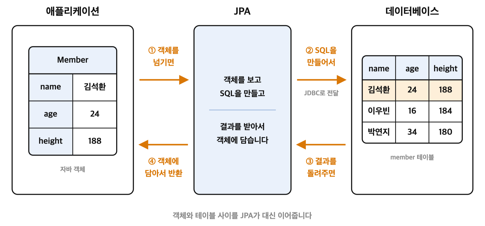

왼쪽에는 우리가 자바에서 다루는 `Member` 객체가 있고, 오른쪽에는 DB에 실제로 저장되어 있는 `member` 테이블이 있습니다

주황색으로 칠해진 줄을 보시면 둘이 같은 데이터를 담고있는데, 하나는 객체이고 하나는 테이블의 행이라 생긴 모양이 다른걸 확인할 수 있습니다

원래는 이 사이를 개발자가 SQL로 직접 이어줘야 했는데, 그림에서는 가운데의 JPA가 대신 이어주고 있습니다

그림의 화살표를 번호 순서대로 따라가보겠습니다


| 단계  | 흐름           | 하는 일                                            |
| --- | ------------ | ----------------------------------------------- |
| ①   | 애플리케이션 → JPA | 우리는 SQL 대신 `Member` 객체를 JPA에게 넘겨줍니다             |
| ②   | JPA → DB     | JPA가 그 객체를 보고 SQL을 직접 만들어서, 아까 봤던 JDBC를 통해 보냅니다 |
| ③   | DB → JPA     | DB가 SQL을 실행하고 그 결과를 돌려줍니다                       |
| ④   | JPA → 애플리케이션 | JPA가 그 결과를 다시 `Member` 객체에 담아서 돌려줍니다            |


보시면 ①번과 ④번은 우리가 객체만 주고받고 있고, ②번과 ③번은 전부 JPA가 대신 하고 있습니다

**여기서 중요한건 SQL이 오가는 ②번과 ③번을 우리가 직접 쓰지 않는다는 점입니다**

**우리는 객체만 다루고, SQL을 만들고 결과를 다시 객체로 바꾸는 일은 JPA가 대신 해준다고 보시면 됩니다**

그래서 아까처럼 나이와 키가 추가되어도, 객체에 필드만 추가해주면 SQL은 JPA가 알아서 다시 만들어줍니다

## JPA의 장점

동작 과정을 봤으니, JPA를 쓰면 어떤 점이 좋은지 하나씩 정리해보겠습니다

**1. 자동 SQL 생성**

방금 본 것처럼 우리가 객체만 넘겨주면 JPA가 SQL을 만들어서 보내줍니다

그래서 테이블마다 똑같은 모양으로 반복해서 적던 `INSERT`, `SELECT`, `UPDATE`, `DELETE`를 직접 쓰지 않아도 됩니다

**2. 1차 캐시**

JPA는 한번 조회한 엔티티를 바로 버리지 않고 잠깐 들고 있습니다

그래서 같은 데이터를 또 조회하면 DB까지 가지 않고, 들고 있던 객체를 그대로 돌려줍니다

같은 회원을 두번 조회해도 SQL은 한번만 나가는 셈입니다

**3. 변경 감지**

조회해온 객체의 값을 바꾸기만 하면, JPA가 바뀐 부분을 알아채고 `UPDATE`를 대신 만들어줍니다

```java
Member member = ...;   // 조회해온 회원
member.setHeight(190); // 값만 바꿔줍니다
```

우리는 `UPDATE member SET height = 190 WHERE id = 1` 을 적지 않았는데도 DB의 값이 바뀌게 됩니다

**4. 지연 로딩**

연관된 데이터를 처음부터 전부 꺼내오지 않고, 실제로 사용하는 시점에 조회합니다

회원 이름만 보고 싶은데 그 회원이 쓴 글 100개까지 같이 딸려오면 낭비겠죠?

그래서 글은 실제로 꺼내볼 때 조회하도록 미뤄두는 겁니다

**5. 연관관계 매핑**

[8]에서 `post` 테이블이 누가 썼는지 알기 위해 `member_id`를 들고 있었던걸 기억하실겁니다

JPA에서는 이 외래키를 `Member member` 라는 필드로 다룰 수 있게 이어줍니다

테이블에서는 열에 저장된 번호였던게, 객체 입장에서는 그냥 참조가 되는 셈입니다

**정리하면 우리는 객체만 다루고, SQL을 만들고 언제 보낼지 고민하는 일은 전부 JPA에게 넘긴다고 보시면 됩니다**

## 트랜잭션이란?

방금 본 1차 캐시와 변경 감지는 전부 트랜잭션이라는 것 안에서 동작합니다

트랜잭션은 여러 작업을 하나로 묶어서, 전부 성공하거나 전부 실패하게 만들어주는 단위입니다

계좌이체를 하는데 출금은 됐고 입금이 실패하면 큰일나겠죠? 이걸 막아주는게 트랜잭션입니다

이것도 시간상 다루지 못했으니 `@Transactional` 과 함께 따로 공부해보시는걸 추천합니다!

---


# [11] JPA 활용해보기

이제 자바 코드에서 JPA를 어떻게 쓰는지 보겠습니다

## @Entity

`@Entity`는 이 클래스가 DB 테이블과 연결되는 클래스라고 표시해주는 어노테이션입니다

이렇게 표시해둔 클래스를 엔티티(Entity)라고 부르고, JPA는 이 표시가 붙어있는 클래스만 관리해줍니다

```java
@Entity
public class Member {

    private String name;
    private int age;
    private int height;
}
```


## @Table

`@Table`은 클래스 이름과 실제 테이블 이름이 다를 때, 어느 테이블과 연결할지 직접 적어주는 어노테이션입니다

클래스 이름은 `Member`인데 DB에 있는 테이블 이름은 `user`라면 이렇게 적어줍니다

```java
@Entity
@Table(name = "user")
public class Member {
    ...
}
```

**그럼 이름을 같게 한다면 굳이 안써도 되겠죠?**

```java
@Entity // 클래스 이름이 Member라서 member 테이블과 자동으로 연결됩니다
public class Member {
    ...
}
```

클래스 이름과 테이블 이름이 같으면 `@Table`은 생략하셔도 됩니다

## @Id

`@Id`는 이 필드가 테이블의 기본키(Primary Key)라고 표시해주는 어노테이션입니다

기본키는 행 하나하나를 구분해주는 값이고, `member` 테이블에서는 `id` 열이 그 역할을 하고 있었습니다

엔티티에는 `@Id`가 반드시 하나 있어야 하고, JPA는 이 값으로 어느 행인지를 찾아갑니다

```java
@Id
@GeneratedValue(strategy = GenerationType.IDENTITY)
private Long id;
```

그런데 이렇게만 적어두면 `id` 값을 우리가 직접 넣어줘야 합니다

## @GeneratedValue

그래서 기본키를 자동으로 만들어달라고 맡기는게 `@GeneratedValue`입니다

번호를 누가 만들어주냐에 따라 전략이 나뉘는데, 실무에서 쓰게될 두가지만 보겠습니다


| 전략         | ID를 만드는 곳                  | 주로 쓰는 DB           |
| ---------- | -------------------------- | ------------------ |
| `IDENTITY` | DB의 `auto_increment`에 맡깁니다 | MySQL              |
| `SEQUENCE` | DB의 시퀀스에서 번호를 받아옵니다        | PostgreSQL, Oracle |


**MySQL을 쓰신다면** `IDENTITY`**, PostgreSQL이나 Oracle을 쓰신다면** `SEQUENCE`**라고 기억하시면 됩니다**

이 외에 `TABLE`, `AUTO` 전략도 있지만 거의 쓰지 않으니, 위의 두가지만 알고 계셔도 충분합니다

## @Column

`@Column`은 필드와 연결될 열의 이름이나 조건을 직접 정해주는 어노테이션입니다

```java
@Column(name = "user_name", nullable = false, length = 20)
private String name;
```


| 속성         | 하는 일              | 예시                   |
| ---------- | ----------------- | -------------------- |
| `name`     | 연결할 열의 이름을 정합니다   | `name = "user_name"` |
| `nullable` | 값이 비어있어도 되는지 정합니다 | `nullable = false`   |
| `length`   | 문자열의 최대 길이를 정합니다  | `length = 20`        |


`@Table`과 마찬가지로 필드 이름과 열 이름이 같으면 `@Column`도 생략할 수 있습니다

## @OneToMany 와 @ManyToOne

JOIN에서 봤던 회원과 글의 관계를 다시 가져와보겠습니다

김석환이 `자바 정리`, `SQL 정리` 두개의 글을 썼다고 하면, 회원 한명(One)에 글 여러개(Many)가 붙는 관계가 됩니다

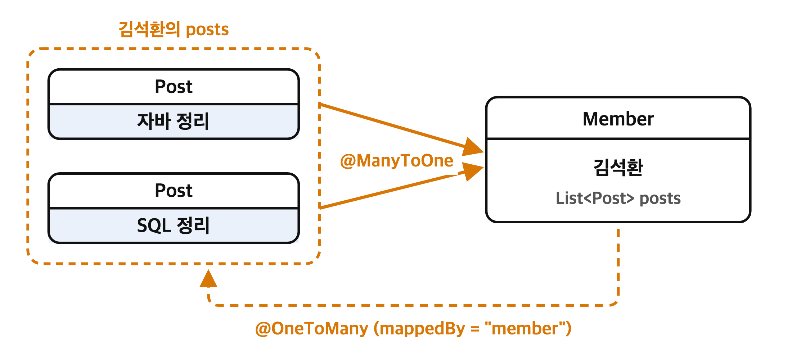

이걸 어느 쪽 입장에서 보느냐에 따라 부르는 이름이 달라집니다

**@ManyToOne**

글 여러개(Many)가 회원 한명(One)을 바라보는 쪽이고, 외래키를 들고있는 쪽입니다

```java
// Post 클래스
@ManyToOne
@JoinColumn(name = "member_id")
private Member member;
```

`@JoinColumn`에는 어느 열이 외래키인지를 적어주는데, `post` 테이블이 들고 있던 그 `member_id`가 들어갑니다

**@OneToMany**

반대로 회원 한명(One)이 글 여러개(Many)를 들고있는 쪽이고, 그림의 `posts` 리스트가 이 부분입니다

```java
// Member 클래스
@OneToMany(mappedBy = "member")
private List<Post> posts = new ArrayList<>();
```

`mappedBy`에는 상대방인 `Post`에서 나를 가리키고 있는 필드의 이름을 적어줍니다

**외래키를 실제로 들고있는 쪽은 항상** `@ManyToOne`**이 붙은 쪽이라는 점만 기억하시면 됩니다**

---


# [12] 실습해보기

지금까지 본 내용을 직접 돌려보겠습니다

## MySQL 접속하기

MySQL Workbench를 켜고 `Local instance 3306`을 눌러줍니다

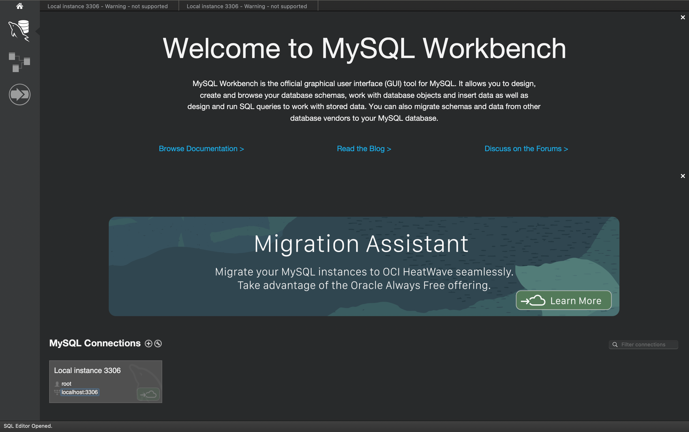

설치할 때 정했던 비밀번호를 입력하면 접속됩니다

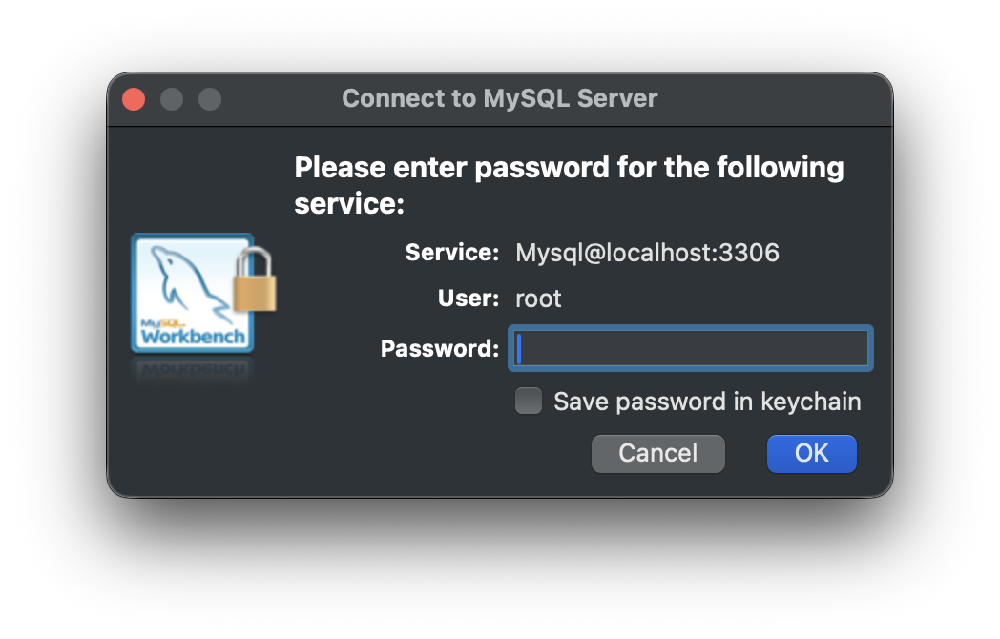

## 스키마 만들기

쿼리창에 아래를 적고 실행해서, 실습에서 사용할 스키마를 하나 만들어줍니다

```sql
CREATE DATABASE student_db; // alt + enter 누르기!
```

여기서 정한 이름이 조금 뒤에 나올 `DB_URL`의 맨 뒤에 들어갑니다

## 프로젝트 만들기

IntelliJ에서 `New Project` → `Spring Boot`를 골라주고, 아래와 같이 맞춰줍니다

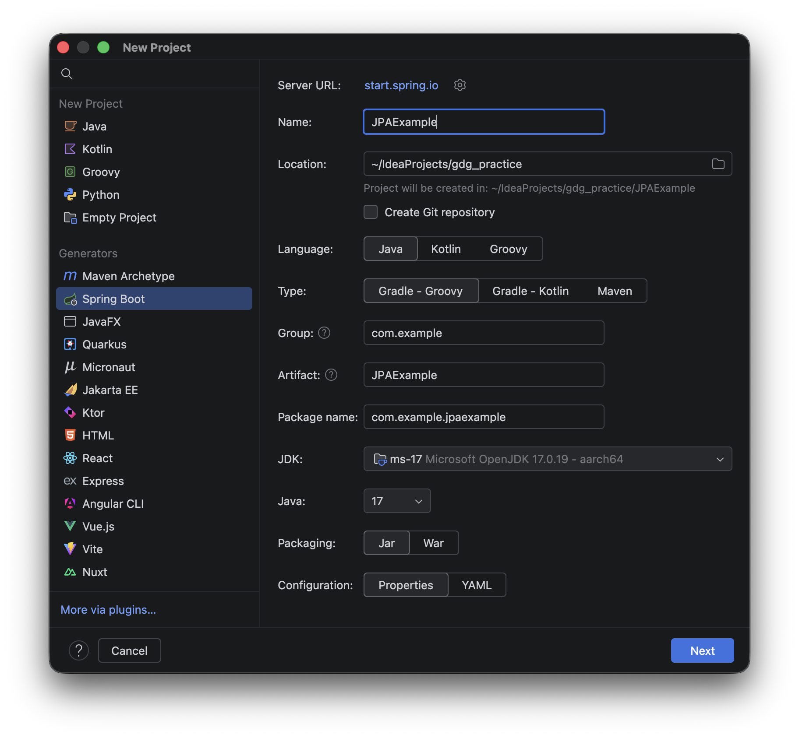

## 의존성 추가하기

`Lombok`, `Spring Web`, `Spring Data JPA`, `MySQL Driver` 네개를 추가해줍니다

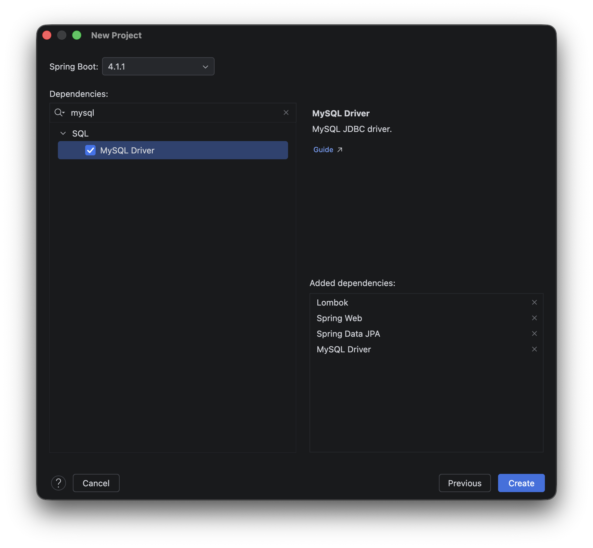

## application.yml로 바꾸기

`application.properties`를 우클릭해서 `Refactor` → `Rename`을 눌러줍니다

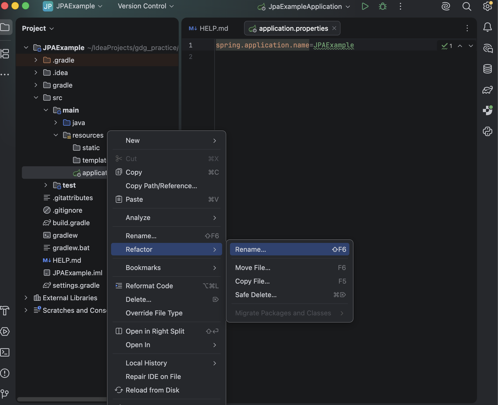

`application.yml`로 이름을 바꿔줍니다

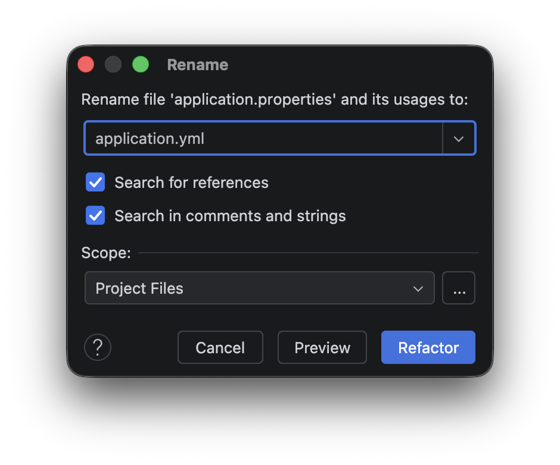

## DB 연결 정보 적기

바꾼 `application.yml`에 DB 접속 정보를 적어줍니다

```yaml
spring:
  datasource:
    url: ${DB_URL}
    username: ${DB_USER_NAME}
    password: ${DB_PASSWORD}
    driver-class-name: com.mysql.cj.jdbc.Driver

  jpa:
    hibernate:
      ddl-auto: create
    properties:
      hibernate:
        show_sql: true
        format_sql: true
    open-in-view: false
```

주소와 비밀번호를 그대로 적으면 깃허브에 그대로 올라가기 때문에, `${}`로 적어두고 값은 환경변수로 넣어주겠습니다

## ddl-auto 옵션

`ddl-auto`는 애플리케이션을 켤 때 테이블을 어떻게 할지 정해주는 값입니다


| 값             | 하는 일                                        |
| ------------- | ------------------------------------------- |
| `create`      | 엔티티와 매핑되는 테이블을 자동으로 만들고, 이미 있으면 지우고 다시 만듭니다 |
| `create-drop` | `create`와 같지만, 애플리케이션이 종료될 때 테이블을 삭제합니다     |
| `update`      | 테이블을 자동으로 만들되, 이미 있으면 바뀐 열만 변경합니다           |
| `validate`    | 엔티티 클래스와 테이블이 정상적으로 매핑되는지 검사만 합니다           |
| `none`        | 아무 일도 일어나지 않습니다                             |


`create`**는 켤 때마다 테이블을 지우고 다시 만들기 때문에, 데이터가 남아야 하는 곳에서는 절대 쓰시면 안됩니다**

## 환경변수 넣기

실행 구성을 눌러서 `Edit Configurations`로 들어갑니다

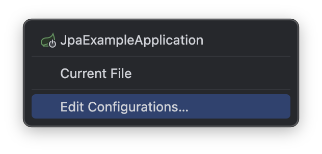

`Modify options` → `Environment variables`를 눌러줍니다

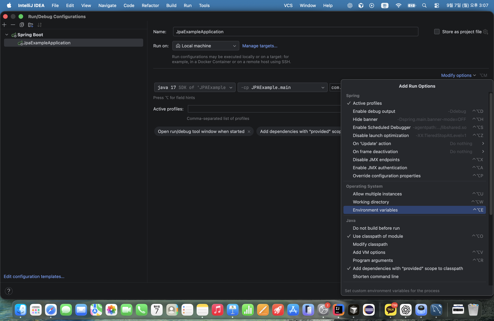

생긴 칸의 오른쪽 아이콘을 눌러줍니다

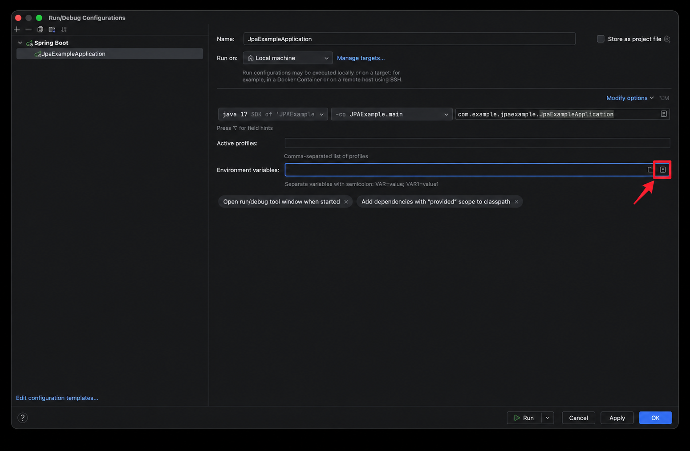

`+`를 눌러서 `application.yml`에 적었던 `${}` 세개를 이름으로 넣고, 값을 채워줍니다

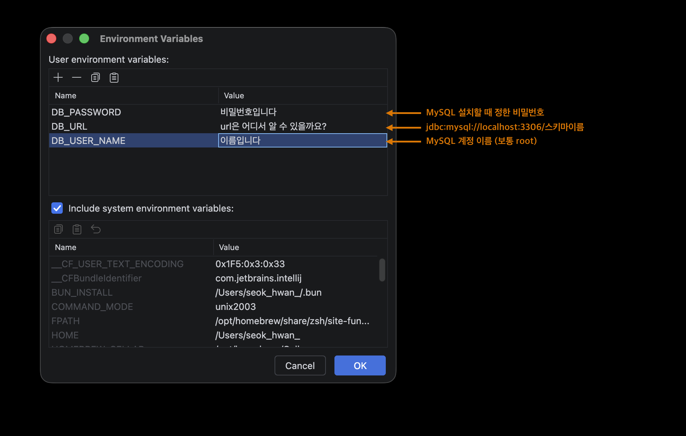

**다 넣었으면** `Apply`**를 꼭 누르고** `OK`**로 닫아주셔야 합니다**

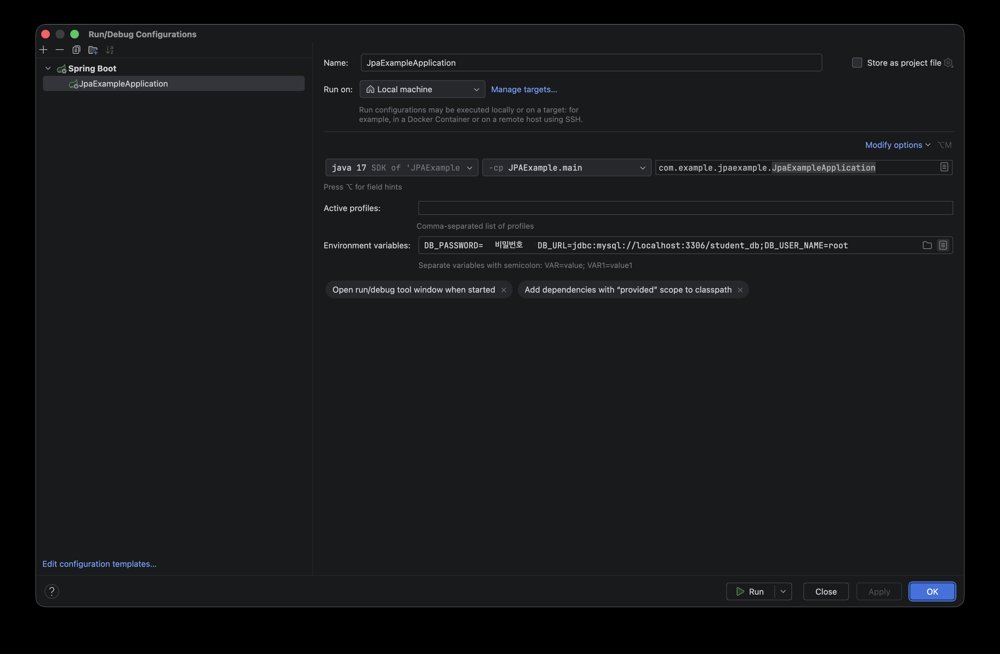

## 최종 구조

여기까지 하면 프로젝트와 `application.yml`이 이런 모습이 됩니다

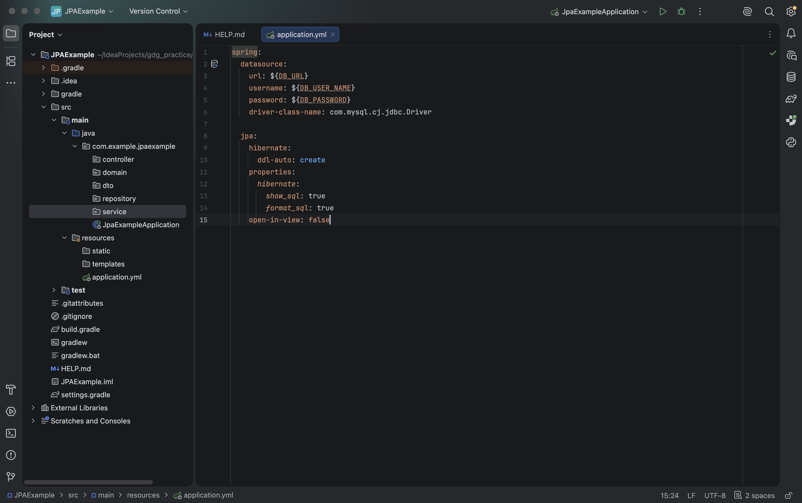

---


# [13] 코드 작성해보기

세팅이 끝났으니, 아까 만들어둔 패키지에 코드를 채워보겠습니다

## 무엇을 만들건가요

학생과 강의를 등록하고, 학생 정보를 조회·수정·삭제하는 기능을 만들어보겠습니다


| 클래스       | 가지고 있는 값                        |
| --------- | ------------------------------- |
| `Course`  | `id`, `courseName`, `professor` |
| `Student` | `id`, `name`, `major`           |


강의 하나에는 학생이 여러명 들어갈 수 있으니, 강의(One)와 학생(Many)의 관계가 됩니다

**그래서 외래키인** `course_id`**는 학생 쪽이 들고있게 되고,** `Student`**가** `@ManyToOne`**,** `Course`**가** `@OneToMany`**를 가집니다**

## Domain 만들기

`domain` 패키지에 클래스 두개를 만들어줍니다

**Course**

```java
@Entity
@Getter
@NoArgsConstructor
public class Course {

    @Id
    @GeneratedValue(strategy = GenerationType.IDENTITY)
    private Long id;

    @Column(nullable = false)
    private String courseName;

    private String professor;

    @OneToMany(mappedBy = "course", fetch = FetchType.LAZY, cascade = CascadeType.ALL, orphanRemoval = true)
    private List<Student> students = new ArrayList<>();

    @Builder
    public Course(String courseName, String professor) {
        this.courseName = courseName;
        this.professor = professor;
    }
}
```

강의 하나가 학생 여러명을 가지고 있으니 `@OneToMany`입니다

`courseName`은 카멜케이스라서 DB에는 `course_name` 열로 만들어집니다

**Student**

```java
@Entity
@Getter
@NoArgsConstructor
public class Student {

    @Id
    @GeneratedValue(strategy = GenerationType.IDENTITY)
    private Long id;

    @Column(nullable = false)
    private String name;

    private String major;

    @ManyToOne(fetch = FetchType.LAZY)
    @JoinColumn(name = "course_id")
    private Course course;

    @Builder
    public Student(String name, String major, Course course) {
        this.name = name;
        this.major = major;
        this.course = course;
    }

    public void update(String name, String major, Course course) {
        this.name = name;
        this.major = major;
        this.course = course;
    }
}
```

학생 여러명이 강의 하나를 바라보고 있으니 `@ManyToOne`이고, `@JoinColumn`에 적은 `course_id`가 실제 테이블에 만들어지는 외래키 열입니다

`update()`는 나중에 수정할 때 쓸 메서드입니다

## Repository 만들기

`repository` 패키지에 인터페이스 두개를 만들어줍니다

```java
// JpaRepository<엔티티 클래스, 엔티티 PK 타입>
public interface CourseRepository extends JpaRepository<Course, Long> {
}
```

```java
public interface StudentRepository extends JpaRepository<Student, Long> {
}
```

`JpaRepository`를 상속받기만 하면 `save`, `findById`, `findAll`, `deleteById` 같은 메서드를 알아서 만들어줍니다

## DTO 만들기

`dto` 패키지에, 요청을 받을 DTO와 응답을 내보낼 DTO를 만들어줍니다

**Course DTO**

```java
@Getter
public class CourseSaveRequestDto {
    private String courseName;
    private String professor;
}
```

```java
@Builder
@Getter
public class CourseInfoResponseDto {
    private Long id;
    private String courseName;
    private String professor;

    public static CourseInfoResponseDto from(Course course) {
        return CourseInfoResponseDto.builder()
                .id(course.getId())
                .courseName(course.getCourseName())
                .professor(course.getProfessor())
                .build();
    }
}
```

`from()`은 `Course` 객체를 응답용 DTO로 바꿔주는 메서드입니다

**Student DTO**

```java
@Getter
public class StudentSaveRequestDto {
    private Long courseId;
    private String name;
    private String major;
}
```

```java
@Builder
@Getter
public class StudentInfoResponseDto {
    private Long id;
    private String name;
    private String major;
    private Long courseId;
    private String courseName;

    public static StudentInfoResponseDto from(Student student) {
        return StudentInfoResponseDto.builder()
                .id(student.getId())
                .name(student.getName())
                .major(student.getMajor())
                .courseId(student.getCourse().getId())
                .courseName(student.getCourse().getCourseName())
                .build();
    }
}
```

학생을 등록할 때는 강의를 `id`로만 받고, 응답할 때는 강의 이름까지 같이 꺼내서 보내줍니다

## Service 만들기

`service` 패키지에 실제로 일을 하는 클래스를 만들어줍니다

**CourseService**

```java
@Service
@RequiredArgsConstructor
public class CourseService {

    private final CourseRepository courseRepository;

    @Transactional
    public CourseInfoResponseDto saveCourse(CourseSaveRequestDto courseSaveRequestDto) {
        Course course = Course.builder()
                .courseName(courseSaveRequestDto.getCourseName())
                .professor(courseSaveRequestDto.getProfessor())
                .build();

        courseRepository.save(course);

        return CourseInfoResponseDto.from(course);
    }

    @Transactional
    public void deleteCourse(Long courseId) {
        courseRepository.deleteById(courseId);
    }

    @Transactional(readOnly = true)
    public List<CourseInfoResponseDto> getAllCourse() {
        return courseRepository.findAll()
                .stream()
                .map(CourseInfoResponseDto::from)
                .toList();
    }
}
```

**StudentService**

```java
@Service
@RequiredArgsConstructor
public class StudentService {

    private final StudentRepository studentRepository;
    private final CourseRepository courseRepository;

    @Transactional
    public StudentInfoResponseDto saveStudent(StudentSaveRequestDto studentSaveRequestDto) {
        Course course = courseRepository.findById(studentSaveRequestDto.getCourseId())
                .orElseThrow(() -> new IllegalArgumentException("존재하지 않는 강의입니다."));

        Student student = Student.builder()
                .name(studentSaveRequestDto.getName())
                .major(studentSaveRequestDto.getMajor())
                .course(course)
                .build();

        studentRepository.save(student);

        return StudentInfoResponseDto.from(student);
    }

    @Transactional(readOnly = true)
    public StudentInfoResponseDto getStudent(Long studentId) {
        Student student = studentRepository.findById(studentId)
                .orElseThrow(() -> new IllegalArgumentException("요청하신 학생 정보를 찾을 수 없습니다."));

        return StudentInfoResponseDto.from(student);
    }

    @Transactional
    public StudentInfoResponseDto updateStudent(Long studentId, StudentSaveRequestDto studentSaveRequestDto) {
        Student student = studentRepository.findById(studentId)
                .orElseThrow(() -> new IllegalArgumentException("요청하신 학생 정보를 찾을 수 없습니다."));

        Course course = courseRepository.findById(studentSaveRequestDto.getCourseId())
                .orElseThrow(() -> new IllegalArgumentException("존재하지 않는 강의입니다."));

        student.update(studentSaveRequestDto.getName(),
                studentSaveRequestDto.getMajor(),
                course);

        return StudentInfoResponseDto.from(student);
    }

    @Transactional
    public void deleteStudent(Long studentId) {
        studentRepository.deleteById(studentId);
    }

    @Transactional(readOnly = true)
    public List<StudentInfoResponseDto> getAllStudent() {
        return studentRepository.findAll()
                .stream()
                .map(StudentInfoResponseDto::from)
                .toList();
    }
}
```

여기서 `updateStudent`를 보시면 `student.update(...)`만 해주고 `save`를 하지 않았습니다

앞에서 봤던 변경 감지가 바로 여기서 동작하는 부분입니다

`@Transactional`은 중간에 오류가 나면 지금까지 한 작업을 전부 되돌려주고, `readOnly = true`는 조회만 할 때 붙여서 성능을 조금 아껴줍니다

## Controller 만들기

`controller` 패키지에 요청을 받아주는 클래스를 만들어줍니다

**CourseController**

```java
@RestController
@RequiredArgsConstructor
@RequestMapping("/courses")
public class CourseController {

    private final CourseService courseService;

    @PostMapping
    public ResponseEntity<CourseInfoResponseDto> saveCourse(@RequestBody CourseSaveRequestDto courseSaveRequestDto) {
        return ResponseEntity.status(HttpStatus.CREATED).body(courseService.saveCourse(courseSaveRequestDto));
    }

    @DeleteMapping("/{courseId}")
    public ResponseEntity<Void> deleteCourse(@PathVariable Long courseId) {
        courseService.deleteCourse(courseId);
        return ResponseEntity.status(HttpStatus.NO_CONTENT).build();
    }

    @GetMapping
    public ResponseEntity<List<CourseInfoResponseDto>> getAllCourse() {
        return ResponseEntity.status(HttpStatus.OK).body(courseService.getAllCourse());
    }
}
```

**StudentController**

```java
@RestController
@RequiredArgsConstructor
@RequestMapping("/students")
public class StudentController {

    private final StudentService studentService;

    @PostMapping
    public ResponseEntity<StudentInfoResponseDto> saveStudent(@RequestBody StudentSaveRequestDto studentSaveRequestDto) {
        return ResponseEntity.status(HttpStatus.CREATED).body(studentService.saveStudent(studentSaveRequestDto));
    }

    @GetMapping("/{studentId}")
    public ResponseEntity<StudentInfoResponseDto> getStudent(@PathVariable Long studentId) {
        return ResponseEntity.status(HttpStatus.OK).body(studentService.getStudent(studentId));
    }

    @PatchMapping("/{studentId}")
    public ResponseEntity<StudentInfoResponseDto> updateStudent(@PathVariable Long studentId,
                                                                @RequestBody StudentSaveRequestDto studentSaveRequestDto) {
        return ResponseEntity.status(HttpStatus.OK).body(studentService.updateStudent(studentId, studentSaveRequestDto));
    }

    @DeleteMapping("/{studentId}")
    public ResponseEntity<Void> deleteStudent(@PathVariable Long studentId) {
        studentService.deleteStudent(studentId);
        return ResponseEntity.status(HttpStatus.NO_CONTENT).build();
    }

    @GetMapping
    public ResponseEntity<List<StudentInfoResponseDto>> getAllStudent() {
        return ResponseEntity.status(HttpStatus.OK).body(studentService.getAllStudent());
    }
}
```

`@RequestBody`는 요청에 담겨온 JSON을 DTO로 바꿔주고, `@PathVariable`은 주소에 들어있는 `{studentId}` 같은 값을 꺼내줍니다

## 포스트맨으로 테스트하기

애플리케이션을 켜고 포스트맨으로 아래 주소들을 호출해보시면 됩니다


| 메서드      | 주소                                           | 하는 일     |
| -------- | -------------------------------------------- | -------- |
| `POST`   | `http://localhost:8080/courses`              | 강의 등록    |
| `DELETE` | `http://localhost:8080/courses/{courseId}`   | 강의 삭제    |
| `GET`    | `http://localhost:8080/courses`              | 전체 강의 조회 |
| `POST`   | `http://localhost:8080/students`             | 학생 등록    |
| `GET`    | `http://localhost:8080/students/{studentId}` | 학생 하나 조회 |
| `PATCH`  | `http://localhost:8080/students/{studentId}` | 학생 정보 수정 |
| `DELETE` | `http://localhost:8080/students/{studentId}` | 학생 삭제    |
| `GET`    | `http://localhost:8080/students`             | 전체 학생 조회 |


학생은 강의가 먼저 있어야 등록할 수 있기 때문에, 아래 순서대로 보내주셔야 합니다

```json
POST http://localhost:8080/courses
{
  "courseName": "데이터베이스",
  "professor": "박연지"
}
```

```json
POST http://localhost:8080/students
{
  "courseId": 1,
  "name": "김석환",
  "major": "컴퓨터공학과"
}
```

`GET http://localhost:8080/students`를 호출했을 때 방금 넣은 학생이 강의 이름과 함께 나오면 성공입니다

---

